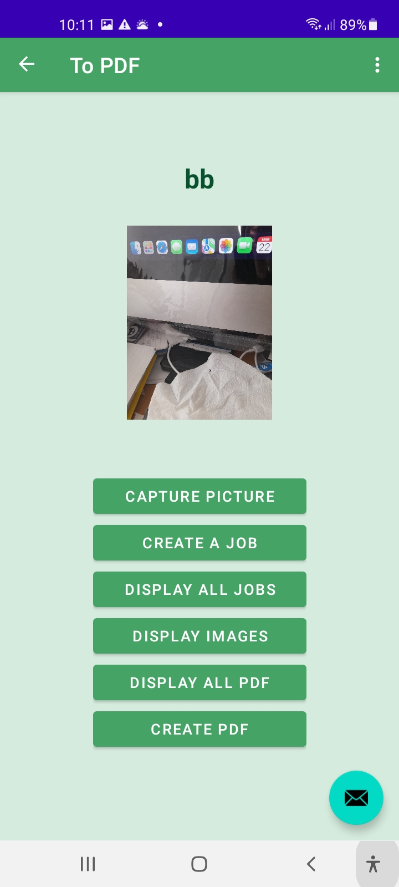

# To PDF

&nbsp;
## To PDF Android mobile App
&nbsp;
&nbsp;
### The app is a tool for users to take photos of paper documents or handwritten notes and create pdf documents.
&nbsp;

### In the app, the user need to create a job before one can take photos. The photos will be stored according to the job on the device.
&nbsp;
### Users are able to view the photos in the job before turning it to a pdf document. Users can also rearrange the order of the photos.
&nbsp;
### The pdf document created will be stored in the device.
&nbsp;
&nbsp;

&nbsp;

 Home screen 

&nbsp;
&nbsp;
 

&nbsp;

 Create a job 

&nbsp;
&nbsp;
 

&nbsp;

 Users can take photos.  The photos will be stored in the device.  Users can take a look at them by choosing the associated job.   

&nbsp;
&nbsp;
 

&nbsp;

 Images in a particular job.   

&nbsp;
&nbsp;
 

&nbsp;

 Users can create the pdf document from the images of a job.  The app will ask for a file name.   

&nbsp;
&nbsp;
 

&nbsp;

 All the pdfs created will be saved in the device.  Users can choose the pdf and display the content in the app.   

&nbsp;
&nbsp;
 

&nbsp;

 Display of pdf content.   

&nbsp;
&nbsp;

## Programming Style

&nbsp;

1. The app was written in Kotlin.  It follows the best practice of Android App architecture.  

2. All the layouts use data binding.  

3. The app adopt the Navigation UI to navigate between fragments of the app.

4. The job list, the pdf list and images list all uses recyclerview to display in the layout.  

5. In the image list, I use Item Touch Helper to provide the swipe to delete function and move function.  

6. I use view models to hold the jobs, images and pdfs' information to use across the fragments.

7. I use Room database to store the job table and image table in the device.

8. I use the iText library to convert the images into a pdf.

